# 第一课：深度学习和神经网络

## 1 深度学习概论
### 1.1 什么是神经网络

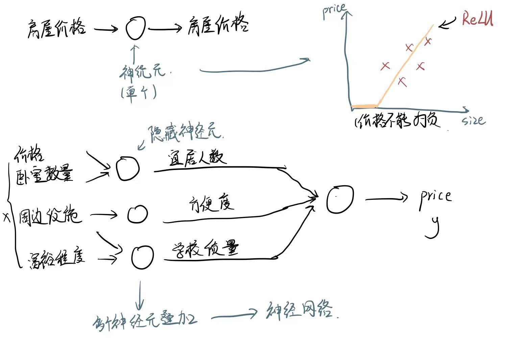        

1. ReLU：修正线性单元，修正是指取不小于0的值

### 1.2 用神经网络进行监督学习（supervised learning）
- 结构化数据：数据库。每个特征有清晰的定义
- 非结构化数据：如音频、图片、文本

### 1.3 深度学习为什么兴起
- 常规学习算法无法处理海量数据，会遇到「平台」
- 神经网络的规模和数据（带有标签的数据）的规模促进了深度学习

## 2 神经网络基础
### 2.1 二分类
- 二分类，最终结果得到一个「是or否」，实现一个分类器
- (x,y)：一个样本
    - x：nx维的特征向量
    - n/nx：一般用于标识输入的特征向量的维度
    - y：标签，0 or 1
    - m：训练集/测试集的样本数量
- 单个样本做**列向量**
    - X.shape=(nx,m)
    - Y.shape=(1,m)
### 2.2  logistic 回归
- 输出y，是一个概率，再0~1之间，所以会用到**sigmod函数**
    - y=sigmod(wx+b)

### 2.3  logistic 回归损失函数
- 损失：y'和y的差别

- **损失函数（Lose function）是衡量单个训练样本的表现，成本函数(Cost function)何亮全体样本的表现**
- logistic的损失函数形式如下：     

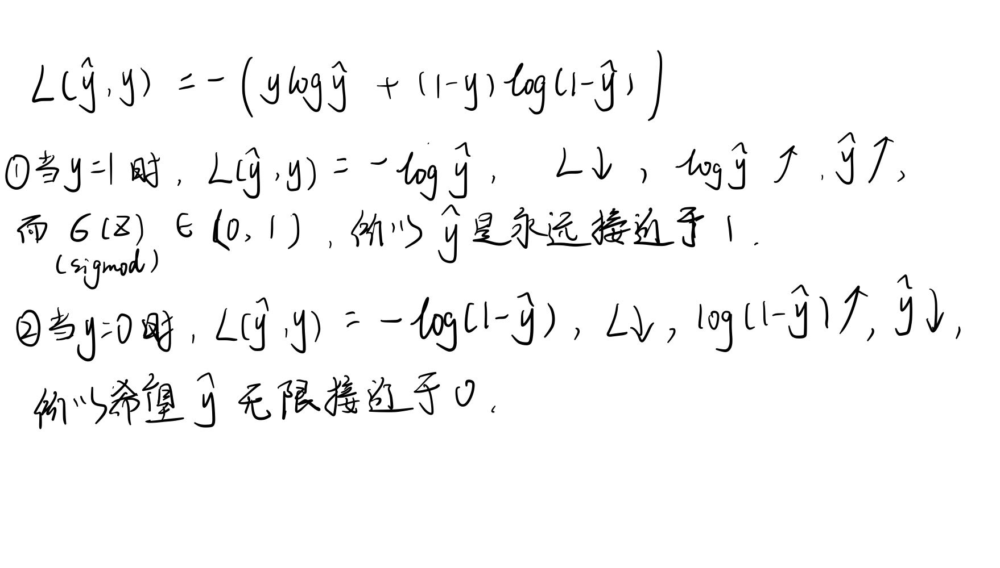         

- 成本函数形式如下：     

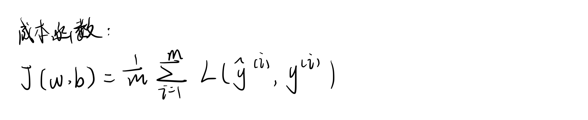         

### 2.4  梯度下降法
- 成本函数J是凹函数，这样就不会存在多个局部最优解      

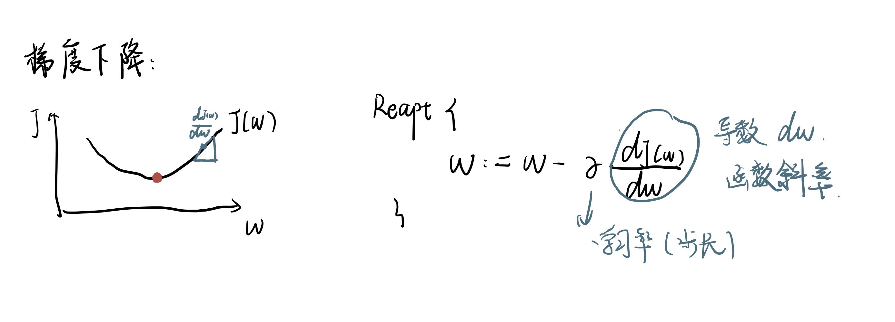      

### 2.5 导数 && 2.6 更多导数的例子
- 这一章节，只需要记住两点：
1. 第一点，导数就是斜率，而函数的斜率，在不同的点是不同的
2. 第二点，如果想知道一个函数的导数，可参考微积分课本或者维基百科，然后应该就能找到这些函数的导数公式。

### 2.7  计算图 && 2.8  计算图的导数计算
- 如图所示，计算图(computation graph)是按照黑色笔记的步骤，从左到右的计算（向前传播），而导数计算则是从右到左的顺序，为红色标记则是**反向传播**

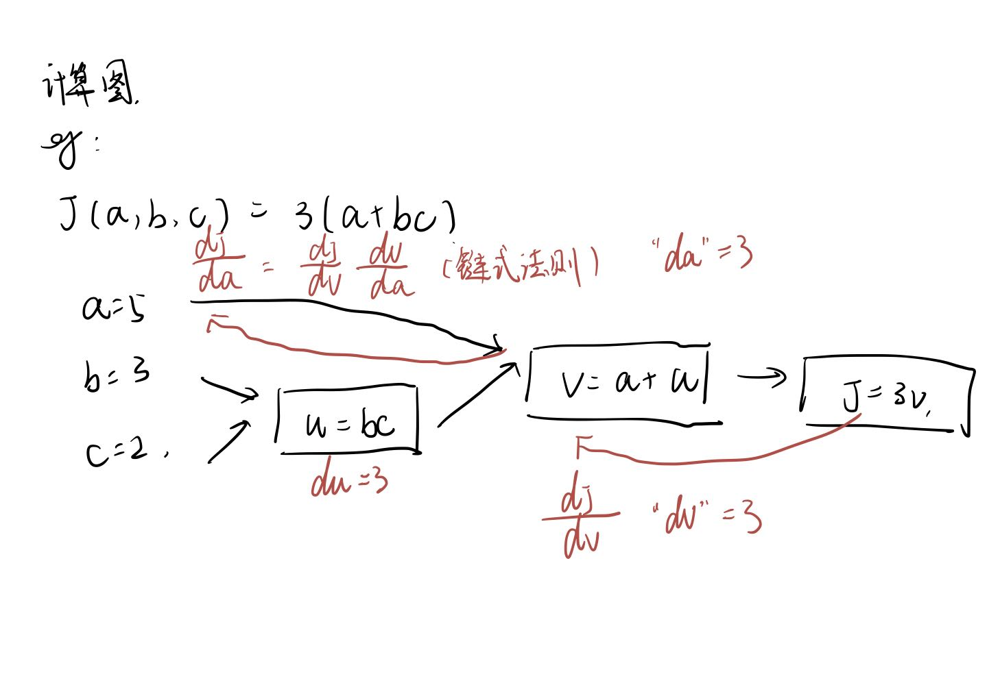     


 
### 2.9  logistic 回归中的梯度下降法 && 2.10  m 个样本的梯度下降     
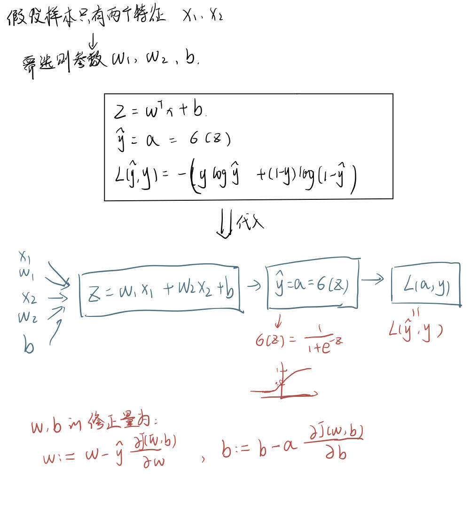    

### 2.11  向量化 && 2.12  向量化的更多例子

- 向量化的目的：
    - 就是为了**消除代码中的显式的for循环语句**
    - `z=np.dot(w,x)+b`代替了一个`for`循环，速度会快很多
- 原理：深度学习一般运行`GPU`或者`CPU`上，他们都有`SIMD(Single Instruction Multiple Data)`即单指令流多数据流，能够以同步的方式，在同一时间内执行同一条指令，即**并行化处理指令**.而`python`的`numpy`能充分进行并行计算
- **只要有其他可能，就不要使用显示for循环**

### 2.13  向量化 logistic 回归

- logistics中的替换
```python
## 将
dw1=0,dw2=0

## 替换为

dw=np.zero((nx,1))

```
  
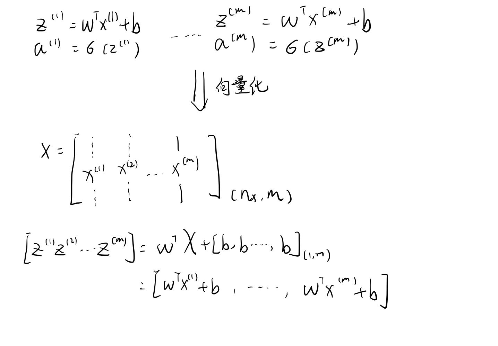      


### 2.14  向量化 logistic 回归的梯度输出

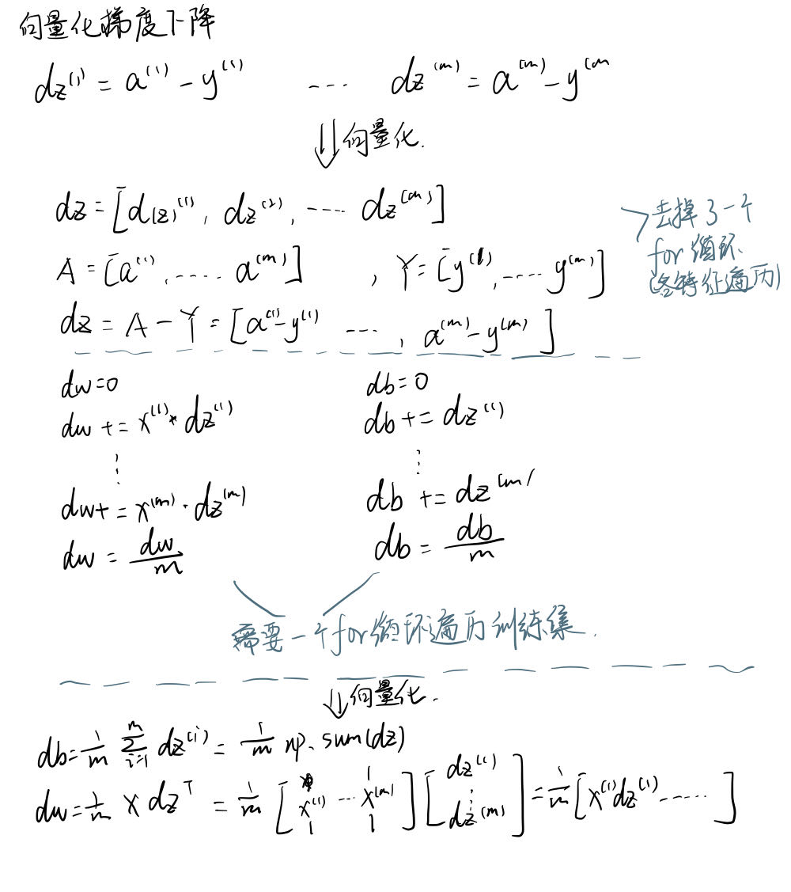      

### 2.15  Python 中的广播
> 用来解决n轮梯度下降迭代的for循环
- 广播的使用：一个向量加上一常数b，b会自动展开成一个对应维度的向量
 
### 2.16  关于 python / numpy 向量的说明

- `a.shape`出来的结果形如`(n,)`，说明`a`是一个秩为1的数组，而不代表他是一个行向量或者列向量。**尽量不要使用如此数据**1
```python
## 第一种
a = np.random.randn(5)  # 会生成一个 (n,)的数组 ，不推荐使用；  或者使用a=a.reshape进行消除

## 第二种

a= np.random.randn(5,1) # a.shape(5,1) 

## 判断，数字维度是否设置正确

assert(a.shape==(5,1))
```

## 3 浅层神经网络

> 学习使用前向传播和反向传播搭建出有一个隐藏层的神经网络。

### 3.1  神经网络概览
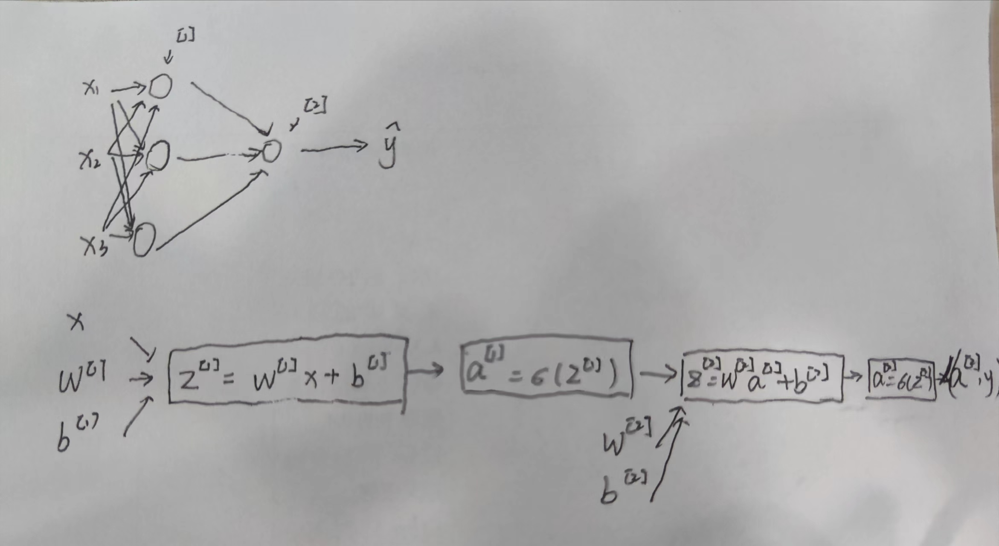     
### 3.2  神经网络表示
- 「隐藏层」在训练集中间是没有办法看到的   

- 双层神经网络：一般输入层算第0层，不计入，输出层算第二层       

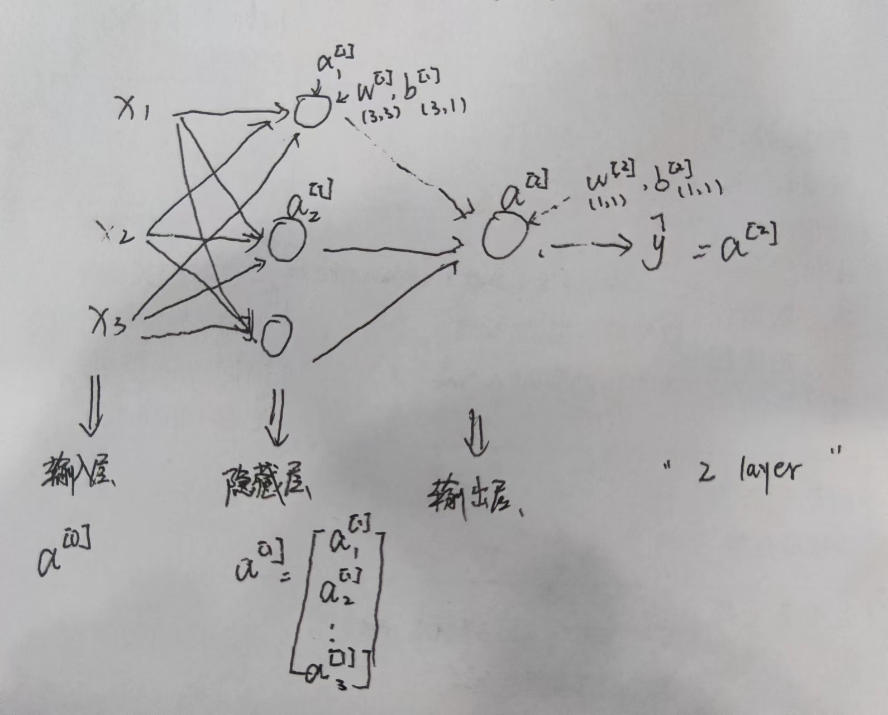     

### 3.3  计算神经网络的输出

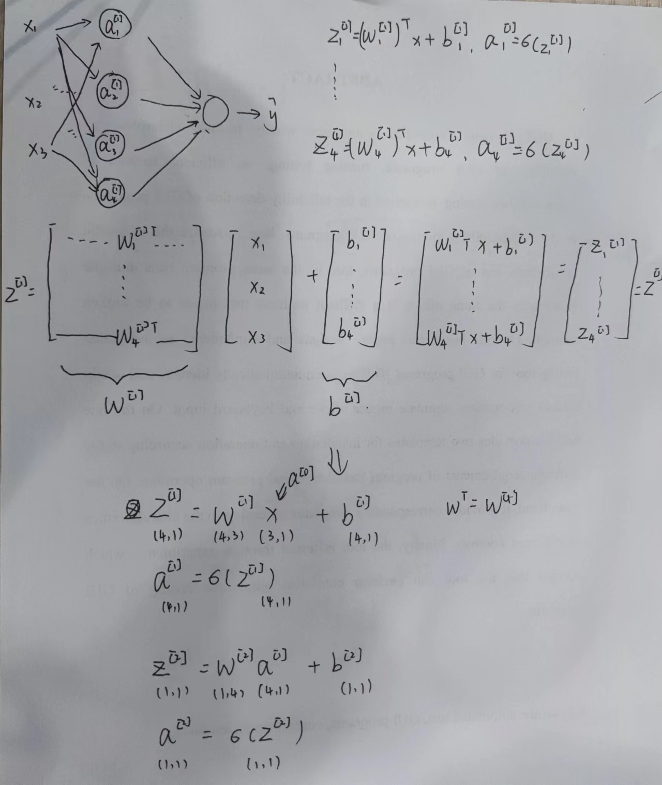     

### 3.4 多样本向量化 && 3.5 向量化实现的解释

- 多样本时的表示       

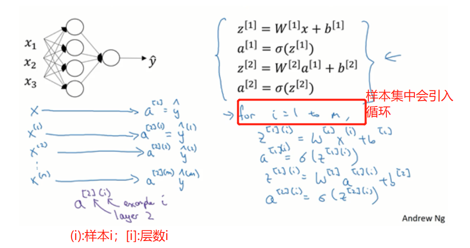      

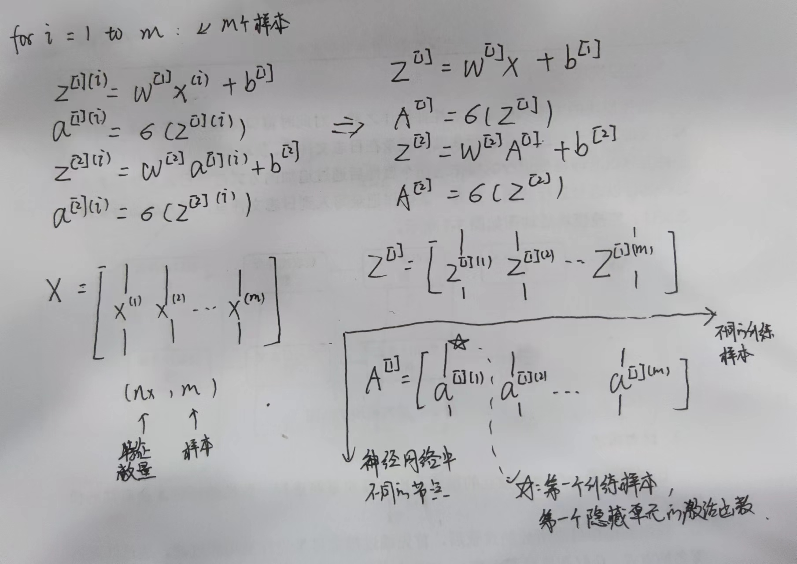     

### 3.6  激活函数

- **`tanh`函数**       
       
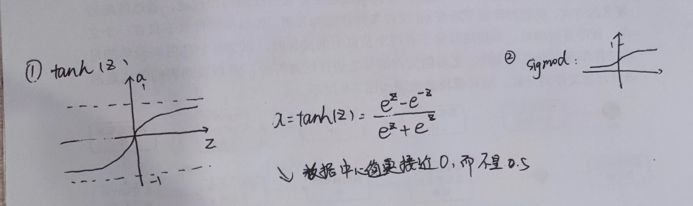          

- 会用sigmoid作为激活函数的一个例外场合是，使用**二分类**算法时，因为这是y的输出期望为`[0,1]`，而不是`[-1,1]`
- 不同层数的激活函数可以不同
- `tanh`和`sigmoid`函数都有一个缺点：**当z非常大或者非常小的时候，那么导数的梯度或者说这个函数的斜率可能非常小，函数的斜率很接近0，会拖慢梯度下降算法**

- **ReLU函数**
    - 有个缺点：**当z为负数时，导数为0**

- **leaky ReLU函数（带泄露的ReLU）**       

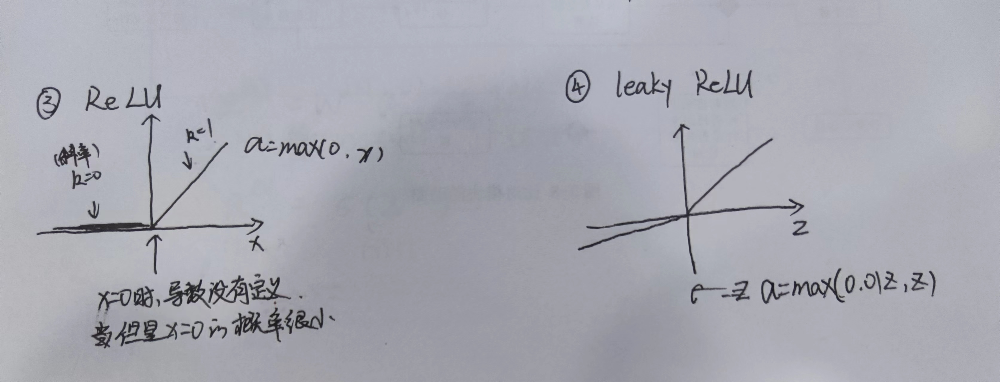      

3.7  为什么需要非线性激活函数？

3.8  激活函数的导数

3.9  神经网络的梯度下降法

3.10  （选修）直观理解反向传播

3.11  随机初始化


 

第四周  深层神经网络：


理解深度学习中的关键计算，使用它们搭建并训练深层神经网络，并应用在计算机视觉中。


4.1  深层神经网络

4.2  深层网络中的前向传播

4.3  核对矩阵的维数

4.4  为什么使用深层表示

4.5  搭建深层神经网络块

4.6  前向和反向传播

4.7  参数 VS 超参数

4.8  这和大脑有什么关系？
## 参考资料

- [课程的文字笔记撰写-第一周：深度学习引言(Introduction to Deep Learning)](http://www.ai-start.com/dl2017/html/lesson1-week1.html)
- [课程的文字笔记撰写-第二周：神经网络的编程基础(Basics of Neural Network programming)](http://www.ai-start.com/dl2017/html/lesson1-week2.html)
- [课程的文字笔记撰写-第三周：浅层神经网络(Shallow neural networks)](http://www.ai-start.com/dl2017/html/lesson1-week3.html)
- [课程目录](https://mooc.study.163.com/smartSpec/detail/1001319001.htm)
- [L1W1作业](https://www.heywhale.com/mw/project/5dd236a800b0b900365eca9b)
- [L1W2作业](https://www.heywhale.com/mw/project/5dd23dbf00b0b900365ecef1)